# 一、配置Java
1. 先安装JDK，可以安装多个版本，在环境变量中新建变量JAVA_HOME，变量值为JDK的路径，我这里选择的是JDK11
	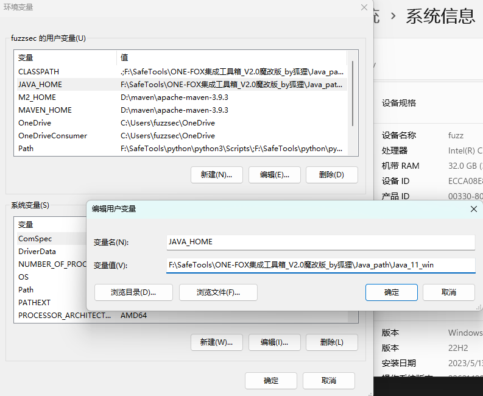
2. vscode安装java插件，如下
	
	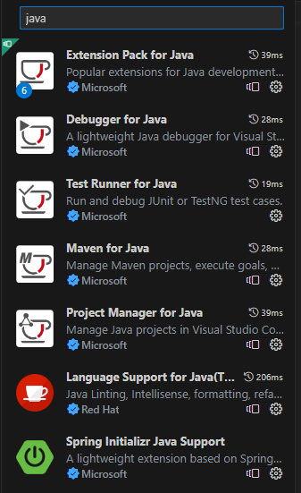
3. 在vscode的设置中搜索javahome，点击“在setting.json中编辑”
	
	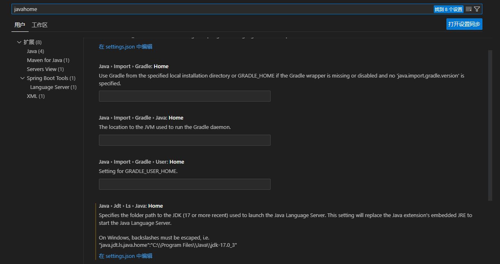
4. 添加java配置，如下
	
	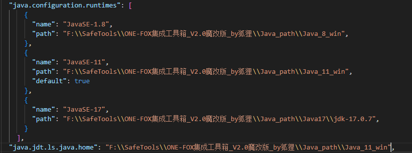
# 二、配置maven
1. 官网下载[maven的二进制zip包](https://dlcdn.apache.org/maven/maven-3/3.9.3/binaries/apache-maven-3.9.3-bin.zip)，解压到合适的位置
	
	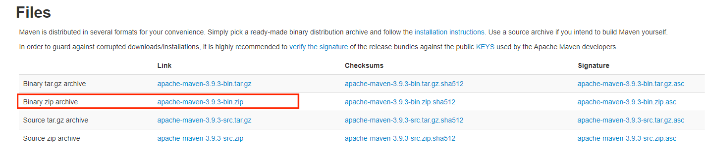
2. 在环境变量中添加两个变量，如下
	
	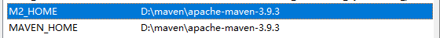
3. 在vscode中设置maven，将maven的setting.xml文件路径添加到如下位置

 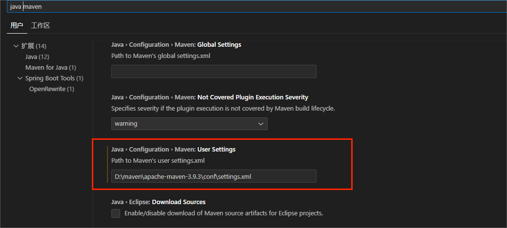
4. 然后就可以通过ctrl + shift + p 快捷键使用maven创建Java项目了
# 三、配置tomcat
1. 到[tomcat官网](https://tomcat.apache.org/)下载tomcat的zip包，如果要用8、9、11版本的JDK的话，建议tomcat不要用太新的，下载好后解压到合适位置
2. 将tomcat的bin路径添加到环境变量
3. vscode安装插件：Community Server Connectors，因为tomcat插件很久没有更新已经被vscode弃用，所以推荐这个插件
4. 创建java项目后，在vscode资源管理器栏的下方会有一个SERVERS的选项，点开，里面有Community Server Connectors，右键选择Create New Server
	
	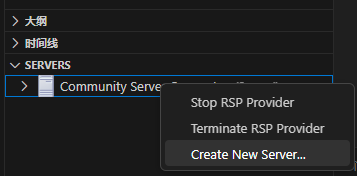
5. 接着会弹出选项框，选择No，使用下载好的tomcat
	
	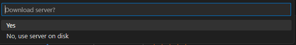
6. 然后就会发现SERVERS下的Community Server Connectors下多了个Tomcat

 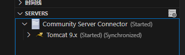
# 四、配置Servlet
1. 使用maven创建好Java项目后，vscode的资源管理界面下方会出现一个JAVA PROJECTS，里面有一个Maven Dependencies选项，这是依赖选项，把需要添加的jar依赖包添加到这里即可
2. 点击Maven Dependencies右侧的+，在弹出的搜索框中输入servlet回车，在搜索出来的结果中选择javax.servlet即可
# 五、创建项目与Servlet
1. ctrl + shift + p，创建Java项目——>Maven——>maven-archetype-webapp，即可创建JavaWeb项目
	
	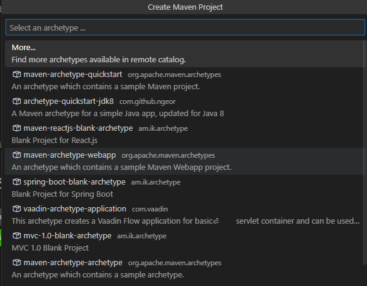
2. 但是由于使用的是maven的默认源，创建的时候会下载很多依赖文件，由于国内网络的特殊原因，可能会很慢，有的下载会卡很久，因此建议先给maven换国内源，修改maven的ssetting.xml文件，将mirror部分修改如下，使用阿里云的镜像源，然后使用maven创建java项目的时候就可以很快完成创建了。
	``` xml
	<mirror>  
        <id>alimaven</id>  
        <name>aliyun maven</name>  
        <url>http://maven.aliyun.com/nexus/content/groups/public/</url>  
        <mirrorOf>central</mirrorOf>          
    </mirror>
```
3. 创建完成后，在src/main下自己新建一个专门存放java文件的目录，根据需要在webapp/WEB-INF下创建专门存放jsp文件的目录

	 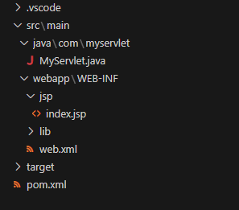
4. 按照前文所述，将Servlet依赖添加到Maven Dependencies中。创建一个HTTPServlet的类，如下

	 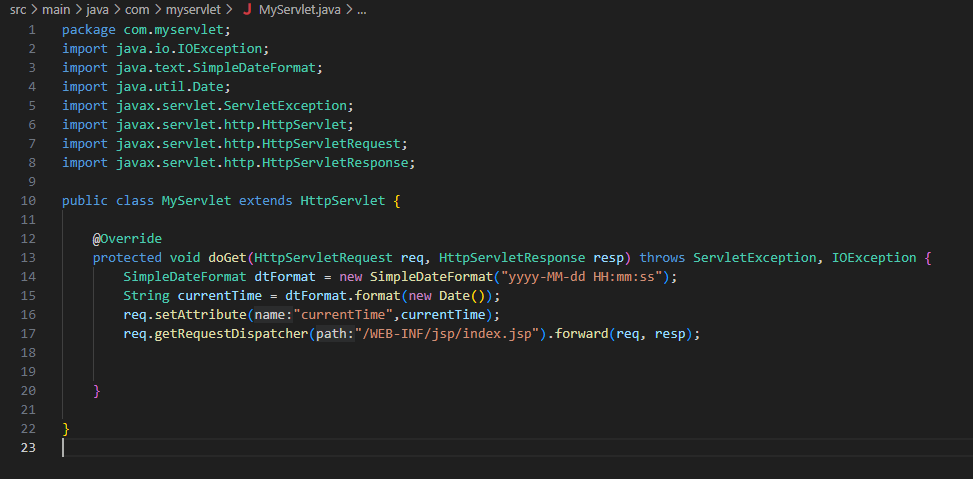
5. 创建一个jsp文件，如下
	
	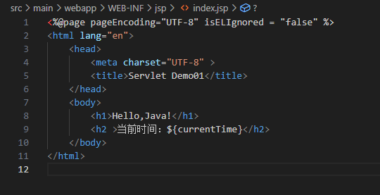
6. 修改web.xml的web-app如下
	``` xml
	<web-app>
	  <display-name>Archetype Created Web Application</display-name>
	  <servlet>
	    <servlet-name>MyServlet</servlet-name>
	    <servlet-class>com.myservlet.MyServlet</servlet-class>
	  </servlet>
	  <servlet-mapping>
	    <servlet-name>MyServlet</servlet-name>
	    <url-pattern>/MyServlet</url-pattern>
	  </servlet-mapping>
	</web-app>
	```
7. 写好之后 ctrl + shift + p使用maven执行命令，选择compile编译项目
	
	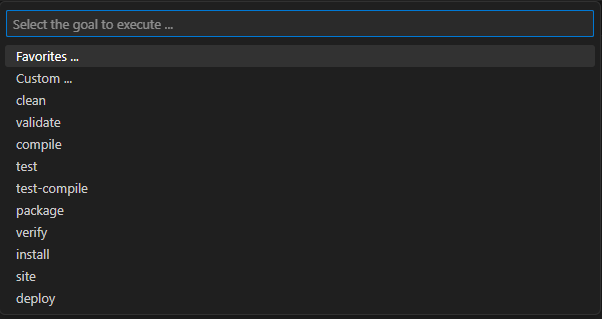
8. 若没有错误，控制台终端中出现“BUILD SUCCESS”的字样，就是编译成功了
	
	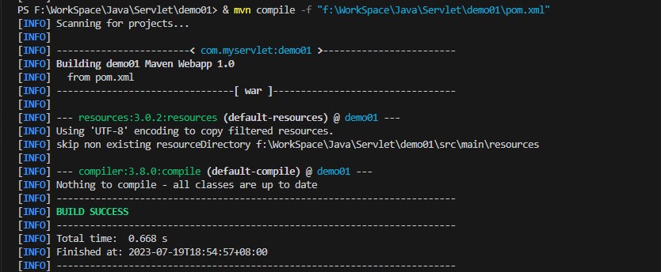
9. ctrl + shift + p使用maven执行命令，选择package编译成war包，成功后在项目的target目录下会多出一个war包，右键选择Run on Server
	
	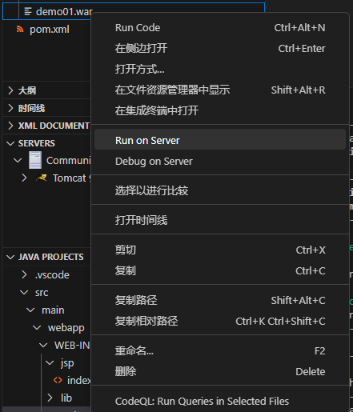
10. 然后就可以在浏览器中访问这个项目了
	
	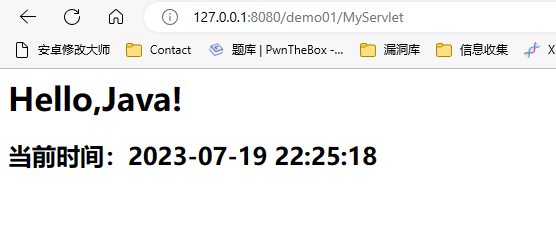
