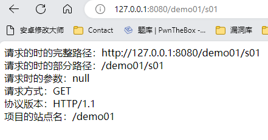
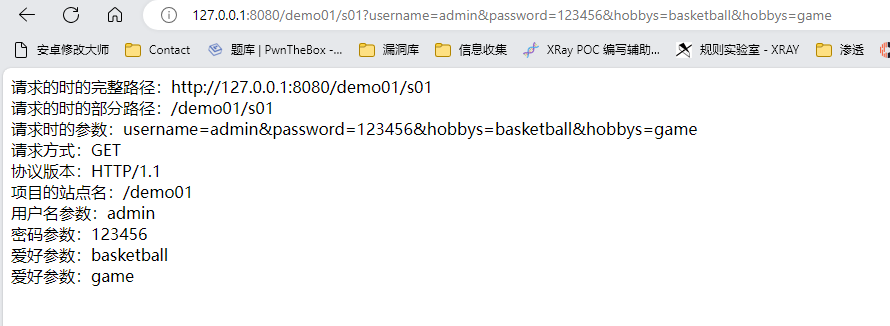

# 一、HttpServletRequest对象概述
1. HttpServletRequest对象主要用来接收客户端发送过来的请求信息，如请求参数、请求头等，service方法中形参接收的是HttpServletRequest接口的实例化对象，表示该对象主要应用在HTTP协议上，该对象是由Tomcat封装好传递过来
# 二、HttpServletRequest接收请求
## （一）常用方法
1. 常用方法

| 方法名 | 作用 |
| ----- | ----- |
| getRequestURL() | 获取客户端发出请求时的完整URL |
| getRequestURI() | 获取请求行中的资源名称部分（项目名称开始) |
| getQueryString() | 获取请求行中的参数部分 |
| getMethod() | 获取客户端请求方式 |
| getProtocol | 获取HTTP版本号 |
| getContextPath() | 获取webapp名字 |
2. 实例，使用HttpServletRequest常用方法输出项目信息
	- Servlet类
		``` java
		package com.myservlet;  

		import java.io.IOException;
		import javax.servlet.ServletException;
		import javax.servlet.http.HttpServlet;
		import javax.servlet.http.HttpServletRequest;
		import javax.servlet.http.HttpServletResponse;  
		
		public class Servlet01 extends HttpServlet {
		    @Override
		    protected void service(final HttpServletRequest req, final HttpServletResponse resp) throws ServletException, IOException {
		        //设置UTF-8编码，防止输出到HTML时中文乱码
		        resp.setContentType("text/html;charset=utf-8");
		        //常用方法
		        //获取请求时的完整路径（从http开始，到“？”前结束)
		        final String url = req.getRequestURL() + "";
		        System.out.println("获取请求的时的完整路径：" + url);
		        resp.getWriter().write("请求的时的完整路径：" + url + "<br>");
		        //获取请求时的部分路径（从项目的站点名开始，到“？”前面结束)
		        final String uri = req.getRequestURI();
		        System.out.println("请求时的部分路径：" + uri);
		        resp.getWriter().write("请求的时的部分路径：" + uri + "<br>");
		        //获取请求的参数字符串（从“？”后面开始，到最后的字符串)
		        final String queryString = req.getQueryString();
		        System.out.println("获取请求时的参数字符串：" + queryString);
		        resp.getWriter().write("请求时的参数：" + queryString + "<br>");
		        //获取请求方式（GET和POST）
		        final String method = req.getMethod();
		        System.out.println("获取请求方式：" + method);
		        resp.getWriter().write("请求方式：" + method + "<br>");
		        //获取当前协议版本（HTTP/1.1）
		        final String prototol = req.getProtocol();
		        System.out.println("获取当前协议版本：" + prototol);
		        resp.getWriter().write("协议版本：" + prototol + "<br>");
		        //获取项目的站点名
		        final String webapp = req.getContextPath(); //上下文路径
		        System.out.println("获取项目的站点名：" + webapp);
		        resp.getWriter().write("项目的站点名：" + webapp + "<br>");
		    }
		}
		```
	- web.xml配置Servlet
		``` xml
		<servlet>
		  <servlet-name>Servlet01</servlet-name>
		  <servlet-class>com.myservlet.Servlet01</servlet-class>
		</servlet>
		<servlet-mapping>
		  <servlet-name>Servlet01</servlet-name>
		  <url-pattern>/s01</url-pattern>
		</servlet-mapping>
		```
	- 访问http://127.0.0.1:8080/项目名/s01，即可看到页面输出了当前的HttpServlet请求信息
		
		
## （二）获取参数
1. 获取请求参数

| 方法 | 作用 |
| ---- | ----|
| getParameter(name) | 获取指定名称的参数 |
|getParameterValue(String name) | 获取指定名称参数的所有值 |
2. 实例，获取指定参数及其值
	- 代码
		``` java
		package com.myservlet;

		import java.io.IOException;
		import javax.servlet.ServletException;
		import javax.servlet.http.HttpServlet;
		import javax.servlet.http.HttpServletRequest;
		import javax.servlet.http.HttpServletResponse;
		
		public class Servlet01 extends HttpServlet {
		    @Override
		    protected void service(final HttpServletRequest req, final HttpServletResponse resp) throws ServletException, IOException {
		        //设置UTF-8编码，防止输出到HTML时中文乱码
		        resp.setContentType("text/html;charset=utf-8");
		        //常用方法
		        //获取请求时的完整路径（从http开始，到“？”前结束
		        final String url = req.getRequestURL() + "";
		        System.out.println("获取请求的时的完整路径：" + url);
		        resp.getWriter().write("请求的时的完整路径：" + url + "<br>");
		        //获取请求时的部分路径（从项目的站点名开始，到“？”前面结束
		        final String uri = req.getRequestURI();
		        System.out.println("请求时的部分路径：" + uri);
		        resp.getWriter().write("请求的时的部分路径：" + uri + "<br>");
		        //获取请求的参数字符串（从“？”后面开始，到最后的字符串
		        final String queryString = req.getQueryString();
		        System.out.println("获取请求时的参数字符串：" + queryString);
		        resp.getWriter().write("请求时的参数：" + queryString + "<br>");
		        //获取请求方式（GET和POST）
		        final String method = req.getMethod();
		        System.out.println("获取请求方式：" + method);
		        resp.getWriter().write("请求方式：" + method + "<br>");
		        //获取当前协议版本（HTTP/1.1）
		        final String prototol = req.getProtocol();
		        System.out.println("获取当前协议版本：" + prototol);
		        resp.getWriter().write("协议版本：" + prototol + "<br>");
		        //获取项目的站点名
		        final String webapp = req.getContextPath(); //上下文路径
		        System.out.println("获取项目的站点名：" + webapp);
		        resp.getWriter().write("项目的站点名：" + webapp + "<br>");  
		
		        //获取请求的参数
		        //获取指定名称的参数
		        String user = req.getParameter("username");
		        resp.getWriter().write("用户名参数：" + user + "<br>");
		        String pass = req.getParameter("password");
		        resp.getWriter().write("密码参数：" + pass + "<br>");
		        //获取指定名称参数的所有值
		        String[] hobbys = req.getParameterValues("hobbys");
		        //判断是否为空
		        if(hobbys != null && hobbys.length > 0){
		            for (String hobby : hobbys) {
		                resp.getWriter().write("爱好参数：" + hobby + "<br>");
		            }
		        }else{
		            resp.getWriter().write("爱好参数为空！<br>");
		        }
		    }
		}
		```
	- 访问，如下
		
		
# 三、请求乱码
1. request接收的客户端请求默认编码为ISO-8859-1，该编码不支持中文，所有当Servlet把请求数据输出到HTML页面时会出现中文乱码的现象
2. 在Servlet类中添加如下代码，即可解决中文乱码问题
	``` java
	resp.setContentType("text/html;charset=utf-8");
	```
