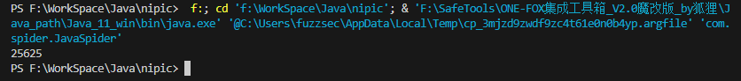

# 一、HttpClient概述
1. java的HTTP协议客户端为HttpClient
# 二、不带参数的GET请求
1. 在Java中使用HttpClient模块通过get方式发起请求，如下示例，获取网站的响应数据长度：
	``` java
	package com.spider;

	import java.io.IOException;
	import org.apache.http.client.methods.CloseableHttpResponse;
	import org.apache.http.client.methods.HttpGet;
	import org.apache.http.impl.client.CloseableHttpClient;
	import org.apache.http.impl.client.HttpClients;
	import org.apache.http.util.EntityUtils;
	
	public class JavaSpider {
	    public static void main(String[] args){
	        String url = "https://www.nipic.com/";
	        //创建HttpClient对象
	        CloseableHttpClient httpClient = HttpClients.createDefault();
	        //创建HttpGet对象，设置url访问地址
	        HttpGet httpGet = new HttpGet(url);
	        CloseableHttpResponse response = null;
	        try {
	            //使用HttpClient发起请求，获取response
	            response = httpClient.execute(httpGet);
	            //解析响应
	            if(response.getStatusLine().getStatusCode() == 200){
	                String content = EntityUtils.toString(response.getEntity(),"utf-8");
	                System.out.println(content.length());
	            }
	        } catch (Exception e) {
	            e.printStackTrace();
	        } finally {
	            try {
	                //关闭responese
	                response.close();
	            } catch (Exception e) {
	                e.printStackTrace();
	            }
	            //关闭HttpClient
	            try {
	                httpClient.close();
	            } catch (IOException e) {
	                // TODO Auto-generated catch block
	                e.printStackTrace();
	            }
	        }
	    }
	}
	```
2. 效果如下，成功获取响应数据长度25625
	
# 三、带参数的GET请求
1. 如下
	``` java
	URIBuilder uriBuilder = new URIBuilder("https://soso.nipic.com");
    //设置参数
    uriBuilder.setParameter("q", "1");
    getUrl(uriBuilder.build());
	```
# 四、POST请求
1. 只需要将`HttpGet httpGet = new HttpGet(url)`改成`HttpPost httpPost = new HttpPost(url)`即可
# 五、带参数的POST请求
1. 参数放到表单中进行提交
	``` java
	package com.spider;

	import java.io.IOException;
	import java.util.ArrayList;
	import java.util.List;
	import org.apache.http.NameValuePair;
	import org.apache.http.client.entity.UrlEncodedFormEntity;
	import org.apache.http.client.methods.CloseableHttpResponse;
	import org.apache.http.client.methods.HttpPost;
	import org.apache.http.impl.client.CloseableHttpClient;
	import org.apache.http.impl.client.HttpClients;
	import org.apache.http.message.BasicNameValuePair;
	import org.apache.http.util.EntityUtils;
	
	public class HttpPostParamTest {
	    public static void main(String[] args) throws Exception{
	        String url = "https://www.itcast.cn/search";
	        //声明List集合，封装表单参数
	        List<NameValuePair> params = new ArrayList<NameValuePair>();
	        params.add(new BasicNameValuePair("keys", "Java"));
	        getUrl(url,params);
	    }
	    //请求网页，提取页面中所有的url
	    private static void getUrl(String url,List<NameValuePair> param) throws Exception{
	        //创建HttpClient对象
	        CloseableHttpClient httpClient = HttpClients.createDefault();
	        //创建HttpGet对象，设置url访问地址
	        HttpPost httpPost = new HttpPost(url);
	        //创建表单的Entry对象
	        UrlEncodedFormEntity formEntity = new UrlEncodedFormEntity(param, "utf-8");
	        //设置表单的Entry对象到post请求中
	        httpPost.setEntity(formEntity);
	        CloseableHttpResponse response = null;
	        try {
	            //使用HttpClient发起请求，获取response
	            response = httpClient.execute(httpPost);
	            //解析响应
	            if(response.getStatusLine().getStatusCode() == 200){
	                String content = EntityUtils.toString(response.getEntity(),"utf-8");
	                System.out.println(content.length());
	                //使用正则处理返回包的HTML源码，提取所有的URL
	            }
	        } catch (Exception e) {
	            e.printStackTrace();
	        } finally {
	            try {
	                //关闭responese
	                response.close();
	            } catch (Exception e) {
	                e.printStackTrace();
	            }
	            //关闭HttpClient
	            try {
	                httpClient.close();
	            } catch (IOException e) {
	                // TODO Auto-generated catch block
	                e.printStackTrace();
	            }
	        }
	    }
	}
	```
